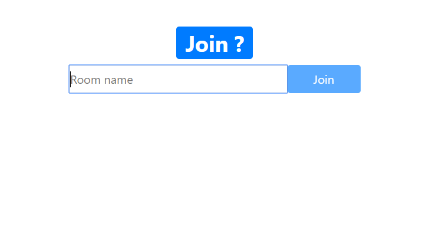
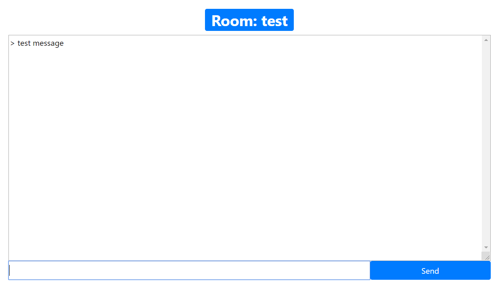

# channels test

一直很想玩玩django的websocket，google找到channels，所以就來玩玩看

## Pre environment setup

Redis: `docker run --name some-redis  -p 6379:6379  -d redis redis-server --appendonly yes`

## local start
`python manage.py runserver 127.0.0.1:8081`  
`cd vue_chat`  
`npm run dev`  

[http://127.0.0.1:8080/](http://127.0.0.1:8080/)  

## Note
如果系統是Windows要多裝win32api: `pip install pywin32` (這次練習時是裝224版)

## Docker
`docker-compose up`  
[http://127.0.0.1:8083](http://127.0.0.1:8083/)  

## Demo
剛開始的畫面選擇要進哪個聊天室  
  
進去後就可以跟同個聊天室的人聊天  
  

## Reference
[Django Channels](https://channels.readthedocs.io/en/latest/)  
[twtrubiks/django-channels2-tutorial](https://github.com/twtrubiks/django-channels2-tutorial)  
[跟著 Vue 闖蕩前端世界](https://dotblogs.com.tw/wasichris/2017/03/01/172049)  
